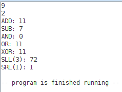
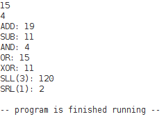
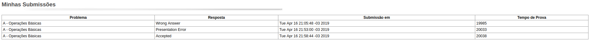

| Aluno | Matricula | Turma |
|-------|-----------|-------|
| Victor Rodrigues Silva | 16/0019516 | A |

# Trabalho 1

## Softwares Utilizados

- Armazenamento e controle de versão no [repositório GitHub](https://github.com/VictorRodriguesS0/FAC)
- Sistema Operacional Utilizado: Sistema Operacional [Linux Ubuntu 16.04](https://www.ubuntu.com/download)
- Software Utilizado para Documentação: [Visual Studio Code](https://code.visualstudio.com/) em MarkDown
- Software Utilizado para Implementação: [MARS 4.5](http://courses.missouristate.edu/KenVollmar/mars/)
- Software Utilizado para Testes com `main`:  [QtSpim](http://spimsimulator.sourceforge.net/)

## Entradas e Saídas

| Entradas Utilizadas | Saídas Obtidas | Saídas Esperadas |
|---------------------|----------------|------------------|
| 9   2 | ADD: 11   SUB: 7   AND: 0   OR: 11   XOR: 11   SLL(3): 72   SRL(1): 1 | ADD: 11   SUB: 7   AND: 0   OR: 11   XOR: 11   SLL(3): 72   SRL(1): 1 |
| 15   4 | ADD: 19   SUB: 11   AND: 4   OR: 15   XOR: 11   SLL(3): 120   SRL(1): 2 | ADD: 19   SUB: 11   AND: 4   OR: 15   XOR: 11   SLL(3): 120   SRL(1): 2 |

## Mars

### Entradas e Saídas

Entradas e Saídas da implementação feita no MARS:

## MOJ

Submissões feitas no MOJ

