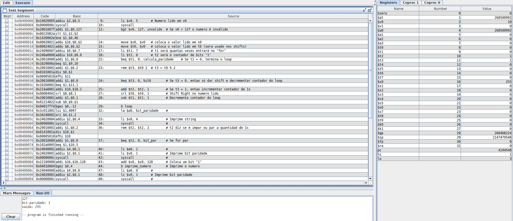
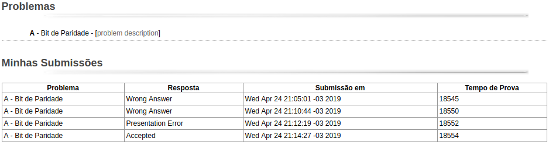

| Aluno                  | Matricula  | Turma |
| ---------------------- | ---------- | ----- |
| Victor Rodrigues Silva | 16/0019516 | A     |

# Trabalho 2

## Softwares Utilizados

- Armazenamento e controle de versão no [repositório GitHub](https://github.com/VictorRodriguesS0/FAC)
- Sistema Operacional Utilizado: Sistema Operacional [Linux Ubuntu 19.04](https://www.ubuntu.com/download)
- Software Utilizado para Documentação: [Visual Studio Code](https://code.visualstudio.com/) em MarkDown
- Software Utilizado para Implementação: [MARS 4.5](http://courses.missouristate.edu/KenVollmar/mars/)
- Software Utilizado para Testes com `main`:  [QtSpim](http://spimsimulator.sourceforge.net/)

## Entradas e Saídas

| Entradas Utilizadas | Saídas Obtidas                       | Saídas Esperadas                     |
| ------------------- | ------------------------------------ | ------------------------------------ |
| 127                 | bit-paridade: 1   saida: 255   | bit-paridade: 1   saida: 255   |
| 128                 | entrada incorreta                    | entrada incorreta                    |

## Mars

### Entradas e Saídas

Entradas e Saídas da implementação feita no MARS:

## MOJ

Submissões feitas no MOJ

